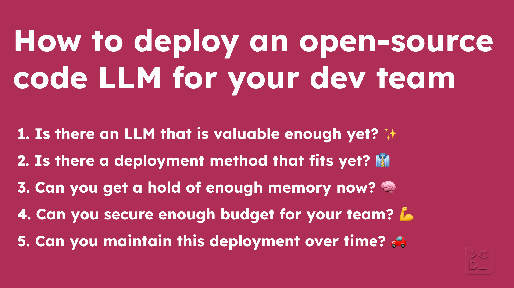

# How to deploy an open-source code LLM for your dev team

Deploying an open-source code LLM for your team right can be difficult. You need to:

- find a deployment method that is private and secure enough
- consistently get the GPUs you need when you need them
- make sure your LLM of choice works reliably on those GPUs
- do it while keeping costs low and timelines short

We started this repository based on what we've learned from the [Continue community](https://github.com/continuedev/continue) and the larger Dev+AI community about how to get through these challenges. Feel free to suggest improvements and help us keep it up-to-date by opening an issue or pull request!

To deploy an open-source code LLM for your dev team, here are the five questions that you need to answer:

1. [Is there an LLM that is valuable enough yet?](#1-is-there-an-llm-that-is-valuable-enough-yet)
2. [Is there a deployment method that fits yet?](#2-is-there-a-deployment-method-that-fits-yet)
3. [Can you get a hold of enough memory now?](#3-can-you-get-a-hold-of-enough-memory-now)
4. [Can you secure enough budget for your team?](#4-can-you-secure-enough-budget-for-your-team)
5. [Can you maintain this deployment over time?](#5-can-you-maintain-this-deployment-over-time)

## 1. Is there an LLM that is valuable enough yet?

Before you invest time into figuring out how to deploy an open-source LLM for your team, it's worth first making sure there is an LLM you want to deploy and figuring out which one that is.

As of October 2023, the [most popular open-source LLMs for coding are 1) Code Llama, 2) WizardCoder, 3) Phind-CodeLlama, 4) Mistral, 5) StarCoder, and 6) Llama 2](https://github.com/continuedev/what-llm-to-use#open-source). We recommend playing around with these models using [Continue](https://github.com/continuedev/continue) and [Together AI](https://together.ai/apis) as your first step. You'll get $25 of free credits when you get started with the Together API, which should be more than enough to try out the different sizes of each of these models:

- Code Llama - Instruct (7B, 13B, 34B)
- WizardCoder (7B, 13B, 34B)
- Phind-CodeLlama (34B)
- Mistral - Instruct (7B)
- StarCoder (15B)
- Llama 2 - Chat (7B, 13B, 70B)

As you play with each of them, you will want to pay attention to both the quality of the suggestions and the speed of the model. You are likely going to want to go with one of the 13B or 34B parameter models for your team. However, on the off chance that you find a 7B model acceptable and everyone on your team has laptops with enough memory, then you might want to consider just having each person run the model locally using [Ollama](https://ollama.ai), [LM Studio](https://lmstudio.ai), or [LocalAI](https://localai.io).

Once you've decided on what LLM you will deploy, the next step is to figure out if there is a deployment method that works for you.

## 2. Is there a deployment method that fits yet?

Depending on whether you work at a small startup or a large organization, you might be able to use all, some, or none of the suggested deployment methods below.

### SaaS providers

#### Together

[Together](https://together.ai) is a cloud platform for running LLMs. All of the most popular open-source code models are available.

#### Hugging Face Inference Endpoints

[Hugging Face Inference Endpoints](https://huggingface.co/inference-endpoints) is another service where you can run most of the popular open-source code LLMs. It's also possible to deploy using your own AWS account via a Private Link.

#### Others

There are a number of other SaaS providers, including [Replicate](https://replicate.com/), [Haven](https://haven.run/), and [Anyscale Endpoints](https://www.anyscale.com/endpoints). If you have experience with these or others, please open an issue / PR and let us know about your experience!

### Cloud providers

Hosting LLMs yourself requires you to create a setup that provides adequate response times while scaling to many concurrent users. As a result, you'll likely want to use technologies that are optimized for this.

#### TGI

Text Generation Inference (TGI) is an open-source toolkit for deploying and serving LLMs. It is designed for fast inference and high throughput, enabling you to provide a highly concurrent, low latency experience. As of October 2023, TGI has been optimized for Code Llama, Mistral, StarCoder, and Llama 2 on NVIDIA A100, A10G and T4 GPUs. It's possible to use other models and different hardware, it just might be a more difficult setup and the models might not perform as well. The easiest way of getting started is using the [official Docker container](https://huggingface.co/docs/text-generation-inference/quicktour).

#### vLLM

vLLM is a fast and easy-to-use library for LLM inference and serving. It has very high serving throughput, handles continuous batching of incoming requests, and manages memory efficiently. As of October 2023, it supports Code Llama, Mistral, StarCoder, and Llama 2, though it's also possible to use other Hugging Face models. Notably, you can use [vLLM with SkyPilot](https://blog.skypilot.co/serving-llm-24x-faster-on-the-cloud-with-vllm-and-skypilot/). To learn more, check out their [docs](https://vllm.readthedocs.io/en/latest/).

#### SkyPilot

SkyPilot is a framework for running LLMs on any cloud, offering maximum cost savings, highest GPU availability, and managed execution. It abstracts away cloud infrastructure by launching jobs and clusters on any cloud, automatically queueing and running them, and maximizing GPU availability by provisioning (with automatic failover) in all zones/regions/clouds you are able to use. You can use it with AWS, Azure, GCP, and a number of other clouds. They have made it easy serve LLMs with vLLM in your own cloud using SkyPilot by [providing a simple SkyPilot yaml task file to launch vLLM](https://github.com/skypilot-org/skypilot/tree/master/llm/vllm). You can also read more in their [docs](https://skypilot.readthedocs.io/en/latest/).

#### AnyScale Private Endpoints

AnyScale Private Endpoints is a full-stack LLM API solution running in your cloud. It's designed to maximize performance and minimize cost inside your own environment. The API it exposes is the same as the OpenAI API format. To learn more, check out its product page [here](https://www.anyscale.com/endpoints#private).

#### AWS

##### AWS VM instances

Using SkyPilot or doing it on your own, you can deploy virtual machines that have GPUs attached. This is where you can set up TGI or vLLM to deploy and serve the LLM. You can learn more about it [here](https://docs.aws.amazon.com/dlami/latest/devguide/gpu.html).

##### Amazon Sagemaker

On Amazon Sagemaker, you can use [Hugging Face Deep Learning Containers (DLCs)](https://aws.amazon.com/blogs/machine-learning/announcing-the-launch-of-new-hugging-face-llm-inference-containers-on-amazon-sagemaker) to deploy LLMs, which are also powered by TGI. Deploying here enables you to use SageMaker’s managed service capabilitiess like autoscaling, health checks, and model monitoring. As of October 2023, it supports Code Llama, Mistral, StarCoder, and Llama 2. There is a notebook that shows how to use Sagemaker for LLM hosting [here](https://github.com/awslabs/llm-hosting-container/blob/main/examples/huggingface/huggingface-large-model-inference.ipynb).

##### AWS Bedrock

[Amazon Bedrock](https://aws.amazon.com/bedrock) is a fully managed service that offers access to performant LLM deployments without having to maintain any infrastructure. As of October 2023, only Llama 2 is available out of the most popular open-source code LLMs.

#### Azure

##### Azure VM Instances

Azure offers GPU optimized virtual machines. You can deploy these virtual machines using SkyPilot or on your own, and then set up TGI or vLLM to serve the LLM. Learn more about it [here](https://learn.microsoft.com/en-us/azure/virtual-machines/sizes-gpu).

#### Azure Maching Learning

The [Azure Maching Learning model catalog](https://ml.azure.com/model/catalog) offers access to LLMs. As of October 2023, only Llama 2 is available out of the most popular open-source code LLMs.

#### GCP

##### GCP VM Instances

On Compute Engine, [you can create](https://cloud.google.com/container-optimized-os/docs/how-to/run-gpus) Container-Optimized OS VM instances that have GPUs attached. This can be done with SkyPilot or on your own. You'll want to set up TGI or vLLM to serve the LLM.

##### GCP Model Garden on Vertex AI

The [Model Garden](https://cloud.google.com/model-garden) provides a curated collection of LLMs. As of October 2023, only Code Llama and Llama 2 are available out of the most popular open-source code LLMs.

#### Others

There are a number of other deployment methods, including [Cog](https://github.com/replicate/cog), [Triton Inference Server](https://github.com/triton-inference-server/server), and [RayLLM](https://github.com/ray-project/ray-llm). If you have experience with these or others, please open an issue / PR and let us know about your experience!

### Resources

- [r/LocalLLaMA: Current best options for local LLM hosting?](https://www.reddit.com/r/LocalLLaMA/comments/1767pyg/current_best_options_for_local_llm_hosting/)
- [Llama 2 on Amazon SageMaker a Benchmark](https://huggingface.co/blog/llama-sagemaker-benchmark)

## 3. Can you get a hold of enough memory now?

Your memory requirements depend on the model you select and the latency required. You are going to need GPUs with enough memory to 1) serve the model and 2) handle parallel requests from your team without response times decreasing too much. Depending on your deployment method and the LLM you want to use, you also might need specific GPUs. Before investing a lot of time in optimizing your deployment, it's generally a good idea to run a pilot with your team to figure out how much memory you will actually need.

### SaaS providers

One of the main benefits of using a SaaS provider is that they typically have already secured the necessary GPUs to serve your model. For some of them, you'll just select the model and won't even need to think about GPUs at all.

### Cloud providers

For the most straightforward deplyoment, you are likely going to want to get your hands on either NVIDIA A100, NVIDIA A10G, or NVIDIA Tesla T4 GPUs. It is possible to use other GPUs though too. Installation and setup just might not be as easy.

Most cloud providers enforce a quota policy, so you might encounter errors when provisioning, especially for in-demand GPUs. Below you will find instructions for how to check and increase your quota limits for each cloud provider. It will usually take a few days for the support team to review after submitting the request. Responding to their inquiry emails on how the requested resources will be used can increase your chances of being approved.

#### AWS

Instructions for requesting a quota increase on AWS can be found [here](https://skypilot.readthedocs.io/en/latest/cloud-setup/quota.html#aws).

#### Azure

Instructions for requesting a quota increase on Azure can be found [here](https://skypilot.readthedocs.io/en/latest/cloud-setup/quota.html#azure).

#### GCP

Instructions for requesting a quota increase on GCP can be found [here](https://skypilot.readthedocs.io/en/latest/cloud-setup/quota.html#gcp).

#### Others

There are a number of GPU-focused clouds, including [Lambda Labs](https://lambdalabs.com/), [Runpod](https://runpod.io), [ShadeForm](https://www.shadeform.ai), [Vast.ai](https://vast.ai/), [FluidStack](https://www.fluidstack.io), [CoreWeave](https://www.coreweave.com), [Paperspace](https://www.paperspace.com/), and [Jarvis Labs](https://jarvislabs.ai). If you have experience with these or others, please open an issue / PR and let us know about your experience!

## 4. Can you secure enough budget for your team?

Costs are highly variable, depending on the model, latency required, deployment method, memory selected, etc. To make sure that deploying an open-source code LLM for your team is close to or under your budget, you are likely going want to try to get a baseline estimate for how much it will cost for your team before you spend a lot of time optimizing your deployment.

### SaaS providers

#### Tokens generated pricing

Some SaaS providers, like Together, charge based on the number of tokens generated. The nice part is that you only pay for what you use. However, this pricing model makes it difficult to estimate how much you will spend. It's a good idea to do a pilot with your team for a couple of weeks to estimate your annual cost.

#### Per unit of time pricing

Other SaaS providers, like Hugging Face Inference Endpoints, charge per unit of time (e.g. hourly). This pricing is more transparent, allowing you to better estimate how much you will spend for each of the different instances. However, you have to select an instance and pay for it, even when you are not using it. You can manually start / stop instances and sometimes even configure settings about when it should start / stop.

### Cloud providers

Our rough estimate is that it will cost somewhere between $500 and $10,000 per month to deploy an open-source code LLM for your team on a cloud provider right now.

Here are some ways you might be able to minimize your costs:

1. [SkyPilot](https://skypilot.readthedocs.io/en/latest/) helps you cut your cloud costs in three ways:

- [Managed Spot](https://skypilot.readthedocs.io/en/latest/examples/spot-jobs.html): "3-6x cost savings using spot VMs with auto-recovery from preemptions"
- Optimizer: "2x cost savings by auto-picking the cheapest VM/zone/region/cloud"
- [Autostop](https://skypilot.readthedocs.io/en/latest/reference/auto-stop.html): "hands-free cleanup of idle clusters"

2. You also might be able to cut costs by using [Activation-aware Weight Quantizated (AWQ)](https://arxiv.org/pdf/2306.00978.pdf) models, which enable you to use smaller GPUs. That said, as of October 2023, overall throughput will still be lower than running vLLM or TGI with unquantzed models. [The Bloke](https://huggingface.co/TheBloke) provides AWQ models for the most popular open-source code LLMs and more. If you do use smaller GPUs, you will still want to make sure there is enough additional VRAM allocated to handle when multiple requests come in parallel. Otherwise, the speed of responses might drop.

### Resources

- [A look at open source AI models](https://www.techtarget.com/searchenterpriseai/feature/A-look-at-open-source-AI-models)

## 5. Can you maintain this deployment over time?

### SaaS providers

One of the other main benefits of using a SaaS provider is that they are responsible for maintenance and not you.

### Cloud providers

To make sure you can maintain this deployment over time, you need to figure out answers to the following questions:

- What happens when the deployment goes down?
- How do you scale the resources allocated if the team grows?
- How will you keep up with the latest open-source LLMs?
- Who is responsible for updating drivers and other dependecies?
- Do you have time to optimize the costs and availability if needed?
- If a new, improved model is released, how much effort will it take to upgrade?

## Contributing

If you see a way to improve our suggestions here, we welcome you to open a PR or an issue! We hope to maintain a community-driven and up-to-date guide of how to deploy an open-source code LLM for a dev team.

*If you liked this blog post and want to read more about Dev+AI–the community of folks building software with the help of LLMs–in the future, join our monthly newsletter [here](https://continue.dev#newsletter).*
